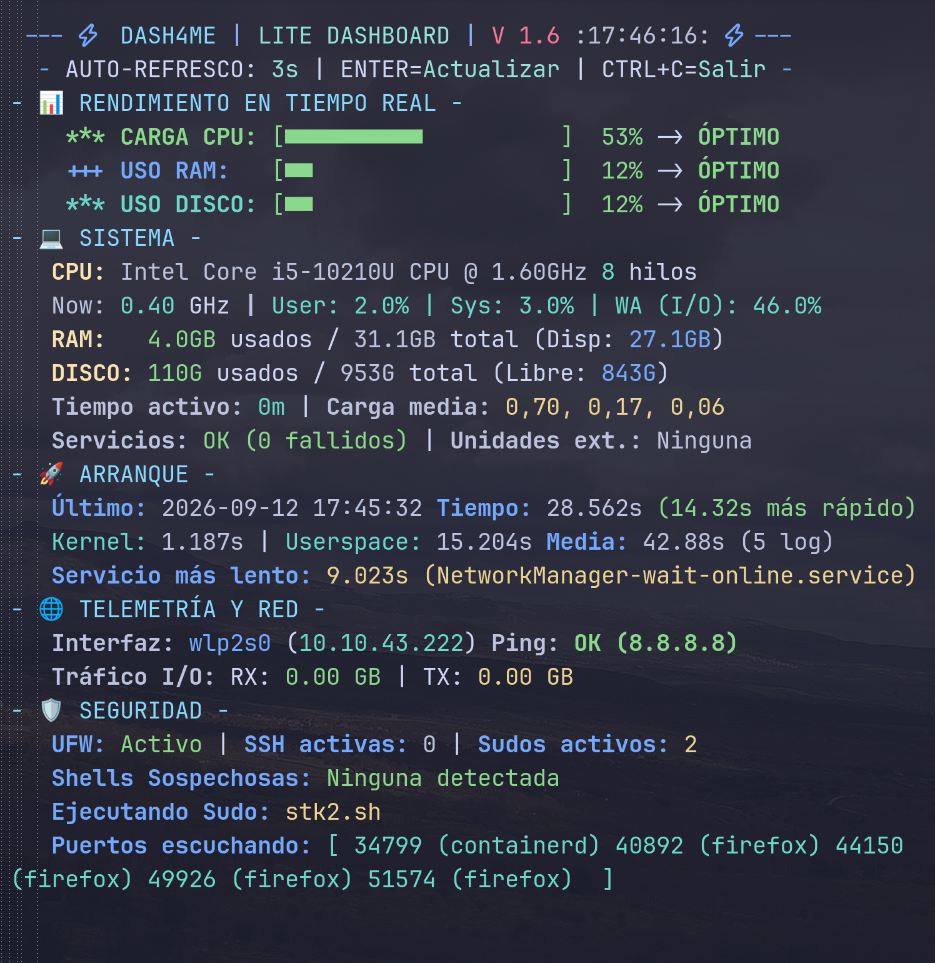

# ⚡ DASH4ME — Lite Terminal Dashboard

<p align="center">
  
  
  
</p>

**DASH4ME** es un panel de control liviano en tiempo real para terminales Linux. Muestra telemetría del sistema, uso de recursos, métricas de arranque y auditorías rápidas de seguridad sin depender de pesadas interfaces gráficas.

---

## 🚀 Características Principales

* **Métricas en Tiempo Real:** Monitorización de carga de CPU, uso de RAM, espacio en disco y memoria SWAP con barras visuales y estados dinámicos.
* **Telemetría y Red:** Muestra la interfaz activa, la IP local, estadísticas I/O (tráfico RX/TX) y prueba la conectividad mediante verificación rápida de Ping.
* **Auditoría de Arranque:** Analiza los tiempos de inicio del Kernel y Userspace (vía `systemd-analyze`), identifica el servicio más lento y mantiene un historial para calcular medias de rendimiento.
* **Monitor de Seguridad y Servicios:** Detecta el estado del firewall (`ufw`), sesiones SSH activas, procesos con `sudo` en ejecución, puertos a la escucha y posible presencia de *shells* sospechosas.
* **Renderizado Optimizado:** Utiliza búfer de pantalla alternativo (`tput smcup/rmcup`) y códigos ANSI para refrescar datos fluidamente sin parpadeos ni acumular historial en la terminal.

---

## 🛠️ Módulos del Panel

* **📊 Rendimiento:** CPU (Carga, GHz e hilos), RAM, SWAP y Disco con interpretación automática (ÓPTIMO, ALTO, CRÍTICO).
* **🚀 Arranque:** Tiempos de carga del sistema, comparación con el promedio histórico registrado y diagnóstico del servicio más lento.
* **🌐 Telemetría y Red:** Monitoreo de la red activa, flujo de datos en GB e indicador de conectividad a internet.
* **🛡️ Seguridad:** Resumen de protección con detección de permisos de superusuario, servicios caídos y alertas preventivas.

---

## 📦 Instalación y Uso

Para ejecutar **DASH4ME** en tu entorno local:

### 1. Clona el repositorio
```bash
git clone [https://github.com/DanSanMar/dash4me.git](https://github.com/DanSanMar/dash4me.git)
cd dash4me 
``` 
### 2. Concede permisos de ejecución al script
```bash
chmod +x dash4me.sh
```
### 3. Inicia el panel
``` bash
./dash4me.sh
``` 
### 🎮 Controles

### Enter: 

Fuerza la actualización inmediata de los datos

### Ctrl + C: 

Sale del panel restaurando la terminal a su estado original.

### 🖥️ Vista Previa de la Interfaz



